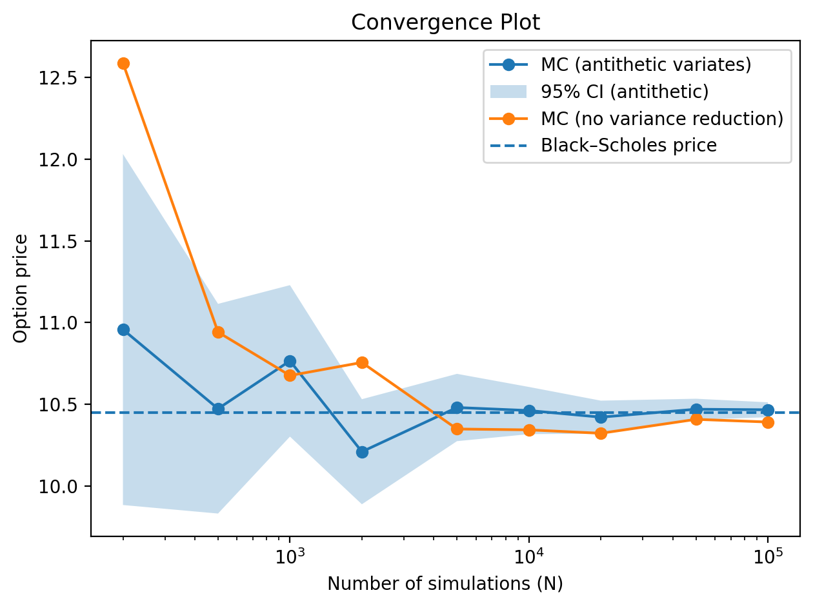

# Monte Carlo Option Pricer

This project builds a Monte Carlo pricer for European call options.
The model is validated against the Black–Scholes price and uses antithetic variates to reduce estimator variance.

---

## Overview

Monte Carlo methods are widely used to price derivatives when closed-form solutions are unavailable.
Although European options can be priced using Black–Scholes, they are useful for understanding how Monte Carlo estimators behave, since results can be benchmarked against the Black–Scholes price.

This project uses European call options to study Monte Carlo convergence and estimator variance.
It demonstrates how antithetic variates reduce variance by pairing negatively correlated simulations, decreasing the standard error without increasing the number of Monte Carlo samples.


---

## Model Assumptions

The underlying asset price follows Geometric Brownian Motion (GBM) under the risk-neutral measure:

$$
S_T = S_0 \exp\left((r - \tfrac{1}{2}\sigma^2)T + \sigma\sqrt{T}Z\right), \quad Z \sim \mathcal{N}(0,1)
$$

The European call option price is estimated as:

$$
C_0 = \mathbb{E}\left[e^{-rT}\max(S_T - K, 0)\right]
$$

---

## Methods Implemented

### 1. Traditional Monte Carlo
- Simulates independent terminal prices $S_T$
- Estimates the discounted payoff mean
- Outputs standard error and 95% confidence intervals

### 2. Antithetic Variates Monte Carlo (Variance Reduction)
- For each normal draw $Z$, also simulates $-Z$
- Averages the paired payoffs into a single Monte Carlo observation
- Introduces perfect negative correlation between samples
- Reduces estimator variance for call options
- Outputs standard error and 95% confidence intervals

### 3. Black–Scholes Benchmark
- Computes the exact closed-form price using the Black-Scholes model
- Used to validate Monte Carlo convergence and confidence intervals

---

## Results

- Monte Carlo estimates converge to the Black–Scholes price as the number of simulations increases
- Antithetic variates significantly reduce estimator variance as shown by reduced standard error
- Black–Scholes price consistently falls within Monte Carlo confidence bands for large $N$

---

## Convergence Visualization

The convergence plot compares:
- Traditional Monte Carlo estimates
- Antithetic Monte Carlo estimates with 95% confidence intervals
- Black–Scholes benchmark

The figure below shows a representative run of the Monte Carlo simulation.


---

## How to Run

Install dependencies:
```bash
pip install numpy scipy matplotlib
